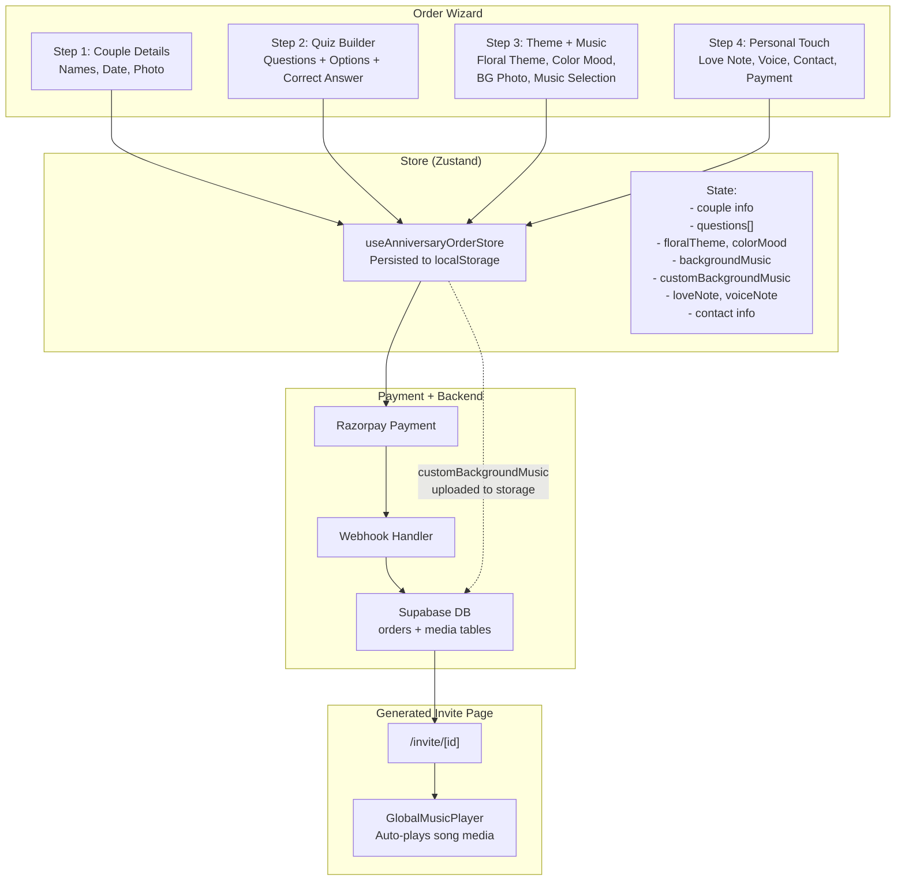
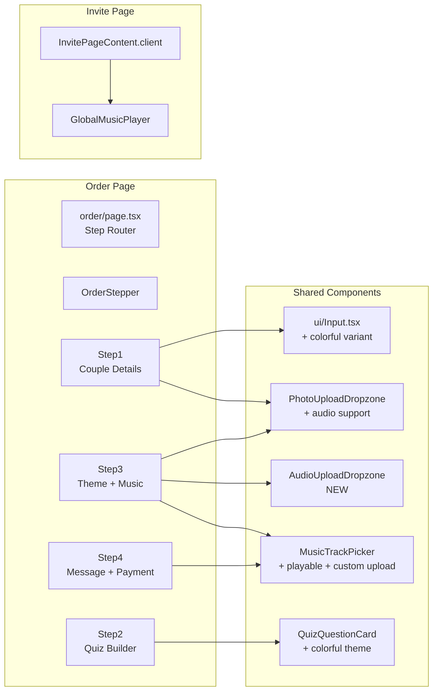

# Anniversary Order Form — UI Enhancement Plan

## Overview

Enhance the `/wed-anniversary-wish/order` multi-step wizard with premium gradient animations, colorful theming, unrestricted date selection, editable predefined questions, and audible background music with custom upload support. Music will auto-play on the generated invite page.

---

## Files to Modify (in execution order)

### Phase 1 — Step 1 Enhancements

#### 1. [`app/(main)/wed-anniversary-wish/order/steps/step1.tsx`](<app/(main)/wed-anniversary-wish/order/steps/step1.tsx>)

**Changes:**

- **Heading:** Enhance "Tell us about your love" with a more vibrant animated gradient (use `logo-gradient-text` style or create a new `.love-story-gradient` class with richer colors and faster shimmer).
- **Colorful sub-headings:** Replace `text-[--color-charcoal]` on all sub-headings (`The couple`, `Your anniversary`, `Couple photo`) with the `.anniversary-gradient-text` class so they get the animated gold-magenta gradient.
- **Colorful input boxes:** Wrap `<Input>` usage — pass custom `className` prop for gradient borders. Replace standard white bg with subtle blush/gold tinted backgrounds. Use animated gradient borders on focus (via Tailwind or inline styles).
- **Date restriction:** Remove `max={today}` from the anniversary date `<Input type="date">` to allow selection of future dates as well. Validation can be adjusted if needed.
- **"Upload your couple photo" label:** Already passed as `label` prop — ensure it's styled with gradient text.

#### 2. [`components/ui/Input.tsx`](components/ui/Input.tsx)

**Changes:**

- Add support for a `colorful` prop (or `variant="anniversary"`) that applies:
  - Gradient border instead of solid gold
  - Tinted background (`bg-[--color-blush]/30`)
  - Animated border on focus with shimmer effect
  - Colorful label text using gradient
- Keep backward compatibility — default behavior unchanged.

#### 3. [`app/globals.css`](app/globals.css)

**Changes:**

- Add new CSS classes:
  - `.love-story-gradient` — richer, faster-shimmering gradient for main heading
  - `.input-gradient-border` — animated gradient border effect for colorful inputs
  - `.glow-focus-ring` — enhanced focus ring with magenta-gold glow

---

### Phase 2 — Step 2 Enhancements

#### 4. [`app/(main)/wed-anniversary-wish/order/steps/step2.tsx`](<app/(main)/wed-anniversary-wish/order/steps/step2.tsx>)

**Changes:**

- **Main heading:** Already uses `.anniversary-gradient-text` — keep as is.
- **Sub-headings & labels:** Make all text colorful — the counter badge (`X of Y questions selected`), the "Add custom question" button text, the "min 5 required" warning.
- **Empty state:** Replace gray/white empty state with a colorful gradient ghost state.
- **Navigation buttons:** Already styled — keep as is.

#### 5. [`components/anniversary-order/QuizQuestionCard.tsx`](components/anniversary-order/QuizQuestionCard.tsx)

**Changes:**

- **Predefined question text editing:** Currently, the question text `<input>` is already editable in the expanded state for ALL questions (both preset and custom). So editing predefined questions already works. However, need to verify that `onUpdate` properly persists changes for preset questions — it does, since the store's `updateQuestion` action works on any question by `id`.
- **Colorful theme:** Replace white/gray backgrounds with themed colorful cards:
  - Enabled questions: gradient background (blush-to-cream) with colored borders based on question index (cycle through gold, magenta, rose, sage)
  - Disabled questions: muted but still tinted
- **Option labels (A, B, C):** Make the correct-answer indicator more prominent with a glowing golden badge. Use the `.anniversary-gradient-text` class for the selected correct answer label.
- **Expand/collapse:** Add colorful chevron with gradient.
- **Remove button:** Style with terracotta gradient when hovered.
- **Question input:** Apply the same "colorful input" styling from Phase 1.

---

### Phase 3 — Step 3 Music Integration

#### 6. [`types/anniversary-order.types.ts`](types/anniversary-order.types.ts)

**Changes:**

- Update `backgroundMusic` field type to support both predefined track IDs and custom uploaded audio:
  ```ts
  backgroundMusic: string | null; // predefined track ID
  customBackgroundMusic: UploadedAsset | null; // custom uploaded audio file
  ```

#### 7. [`hooks/useAnniversaryOrderStore.ts`](hooks/useAnniversaryOrderStore.ts)

**Changes:**

- Add `customBackgroundMusic: UploadedAsset | null` to the state interface and initial state
- Add `setCustomBackgroundMusic: (asset: UploadedAsset | null) => void` action
- Update `partialize` to persist the new field
- Add action:
  ```ts
  setCustomBackgroundMusic: (asset) => set({ customBackgroundMusic: asset }),
  ```

#### 8. [`lib/anniversary-order-validation.ts`](lib/anniversary-order-validation.ts)

**Changes:**

- Update `step3Schema` to include music fields (optional)
- Add validation for custom background music if needed

#### 9. [`app/(main)/wed-anniversary-wish/order/steps/step3.tsx`](<app/(main)/wed-anniversary-wish/order/steps/step3.tsx>)

**Changes:**

- Add **Background Music** section after the Custom Background Photo section:
  - Import `MusicTrackPicker` component
  - Add state for selected track ID
  - Add a **custom music upload dropzone** (reuse `PhotoUploadDropzone` with audio accept type, or create a dedicated `AudioUploadDropzone`)
  - Connect to store: `backgroundMusic` for track ID, `customBackgroundMusic` for uploaded file
- Ensure the music selection is included in step validation
- **Heading color:** Make all headings in step 3 colorful with `.anniversary-gradient-text`

#### 10. [`components/anniversary-order/MusicTrackPicker.tsx`](components/anniversary-order/MusicTrackPicker.tsx)

**Changes:**

- **Make tracks playable/audible:**
  - Use `HTMLAudioElement` to actually play the audio file when preview button is clicked
  - Add audio source paths that exist (or create placeholder handling)
  - Add a play/pause toggle with animated equalizer icon
  - Show progress indicator during playback
- **Restyle:** Apply colorful theme to the track cards — gradient borders, mood-colored backgrounds, animated hover states
- **Custom upload button:** Add a "Upload your own music" button at the bottom that triggers file upload

#### 11. [`components/anniversary-order/PhotoUploadDropzone.tsx`](components/anniversary-order/PhotoUploadDropzone.tsx)

**Changes:**

- Modify to accept an optional `accept` prop to specify file types (default `image/*` for photos, `audio/*` for music)
- Or better: create a new `AudioUploadDropzone` component specifically for music files

#### 12. _(New)_ [`components/anniversary-order/AudioUploadDropzone.tsx`](components/anniversary-order/AudioUploadDropzone.tsx)

**New component** — similar to `PhotoUploadDropzone` but for audio files:

- Accepts `audio/*` files
- Shows audio player with waveform visualization after upload
- Displays file name, duration, and size
- "Remove" button to clear selection

---

### Phase 4 — Invite Page Auto-Play Music

#### 13. [`components/invite/GlobalMusicPlayer.tsx`](components/invite/GlobalMusicPlayer.tsx)

**Changes:**

- Ensure the music auto-plays when the invite page loads (after Gatekeeper unlock)
- Currently it already attempts to play via the `play` prop — verify this works correctly for anniversary quiz invites too
- Add support for playing custom uploaded audio (the `song` media record with `media_type: 'song'` already works)
- Ensure the audio element is created from the `song.file_url`

#### 14. [`app/invite/[id]/InvitePageContent.client.tsx`](app/invite/[id]/InvitePageContent.client.tsx)

**Changes:**

- The `song` is already found via `media.find((m) => m.media_type === "song")` — this will work for both predefined and custom music since both will be stored as media records with `media_type: 'song'`
- No changes needed if the backend correctly stores the custom uploaded music as a media record

---

### Phase 5 — Backend / API Integration (if needed)

#### 15. [`app/api/razorpay/webhook/route.ts`](app/api/razorpay/webhook/route.ts) _(check only)_

- Verify that the webhook correctly processes the `backgroundMusic` and `customBackgroundMusic` fields from the order data and stores custom music as a media record
- If not, add logic to upload custom music to Supabase storage and create a media record with `media_type: 'song'`

#### 16. [`lib/anniversary-constants.ts`](lib/anniversary-constants.ts) _(check only)_

- No changes needed unless new price tiers are required

---

## Data Flow Diagram



---

## Component Hierarchy (Affected)



---

## Execution Order

| #   | File                                                                                                                   | What to do                                                       |
| --- | ---------------------------------------------------------------------------------------------------------------------- | ---------------------------------------------------------------- |
| 1   | [`app/globals.css`](app/globals.css)                                                                                   | Add new gradient/animation CSS classes                           |
| 2   | [`components/ui/Input.tsx`](components/ui/Input.tsx)                                                                   | Add `colorful` / `variant="anniversary"` support                 |
| 3   | [`types/anniversary-order.types.ts`](types/anniversary-order.types.ts)                                                 | Add `customBackgroundMusic` field                                |
| 4   | [`hooks/useAnniversaryOrderStore.ts`](hooks/useAnniversaryOrderStore.ts)                                               | Add new state + actions for custom music                         |
| 5   | [`lib/anniversary-order-validation.ts`](lib/anniversary-order-validation.ts)                                           | Update validation schemas                                        |
| 6   | [`app/(main)/wed-anniversary-wish/order/steps/step1.tsx`](<app/(main)/wed-anniversary-wish/order/steps/step1.tsx>)     | Apply gradient headings, colorful inputs, remove date max        |
| 7   | [`components/anniversary-order/QuizQuestionCard.tsx`](components/anniversary-order/QuizQuestionCard.tsx)               | Colorful theme, ensure question editing works                    |
| 8   | [`app/(main)/wed-anniversary-wish/order/steps/step2.tsx`](<app/(main)/wed-anniversary-wish/order/steps/step2.tsx>)     | Apply colorful theme to all text/badges                          |
| 9   | [`components/anniversary-order/MusicTrackPicker.tsx`](components/anniversary-order/MusicTrackPicker.tsx)               | Make tracks playable, add custom upload option, colorful restyle |
| 10  | _(New)_ [`components/anniversary-order/AudioUploadDropzone.tsx`](components/anniversary-order/AudioUploadDropzone.tsx) | Create audio upload dropzone component                           |
| 11  | [`app/(main)/wed-anniversary-wish/order/steps/step3.tsx`](<app/(main)/wed-anniversary-wish/order/steps/step3.tsx>)     | Add music selection section, apply colorful headings             |
| 12  | [`components/invite/GlobalMusicPlayer.tsx`](components/invite/GlobalMusicPlayer.tsx)                                   | Verify auto-play works for anniversary quiz invites              |
| 13  | [`app/api/razorpay/webhook/route.ts`](app/api/razorpay/webhook/route.ts)                                               | Verify/stub custom music upload handling                         |

---

## Key Design Decisions

1. **Music stays in Step 3** — The current step 3 (Theme: floral + color + bg photo) is being expanded to include background music. The OrderStepper label stays "Theme" or can be changed to "Theme & Music" if desired.
2. **Custom music upload** — Uses a new `AudioUploadDropzone` component (based on `PhotoUploadDropzone`). In production, the custom audio file would be uploaded to Supabase storage and linked as a media record with `media_type: 'song'`.
3. **Predefined tracks** — The 6 curated tracks in `anniversary-music.ts` will have actual audio file paths or a preview mechanism to make them playable.
4. **Date selection** — Removing `max={today}` is the simplest fix. No validation changes needed — the date can be past or future.
5. **Quiz question editing** — Already functional for all questions in expanded state. The colorful theme enhancement makes the UI more vibrant.
