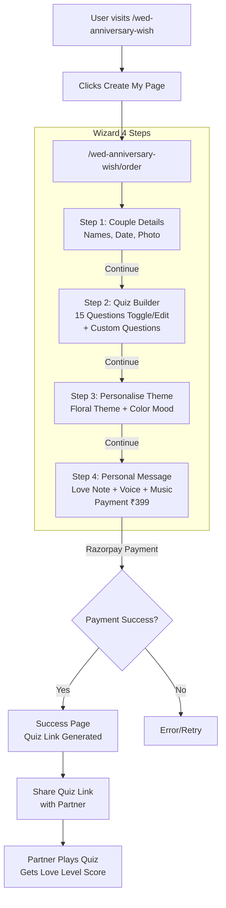

# Anniversary Quiz Order Wizard — Implementation Plan

## Overview

Create a beautiful 4-step single-page order wizard at `/wed-anniversary-wish/order` for the Anniversary Quiz product (₹399). This is a **new route** distinct from the existing wedding invitation `/order` flow.

---

## 1. Route Configuration

### Update `lib/anniversary-constants.ts`

- Change `ANNIVERSARY_ORDER_ROUTE` from `"/order"` → `"/wed-anniversary-wish/order"`
- This automatically updates all CTA button links on the anniversary landing page.

### New Route Structure

```
app/(main)/wed-anniversary-wish/order/
├── layout.tsx        # Minimal polished layout (own sticky header, no main header)
├── page.tsx          # Step orchestrator (like existing app/order/page.tsx)
└── steps/
    ├── step1.tsx     # Couple Details
    ├── step2.tsx     # Quiz Builder
    ├── step3.tsx     # Personalise Theme
    └── step4.tsx     # Personal Message + Payment
```

### Layout Strategy

- `/wed-anniversary-wish/order/layout.tsx` provides its **own clean header** (similar to `app/order/layout.tsx`) rather than inheriting the main `(main)` layout's Header + Footer, since the order flow needs focused immersion.
- The layout should show a subtle "WedInviter" brand link + the ₹399 price tag.

---

## 2. Data Layer

### `types/anniversary-order.types.ts`

```typescript
export interface QuizQuestion {
  id: string;
  text: string;
  options: string[];
  correctAnswer: number; // index of correct option
  enabled: boolean; // toggle ON/OFF
  isCustom: boolean; // user-added vs pre-written
}

export type FloralTheme = "rose" | "jasmine" | "marigold" | "mogra";
export type ColorMood = "romantic-pink" | "royal-gold" | "garden-green";

export interface AnniversaryOrderState {
  // Step 1 — Couple Details
  yourName: string;
  partnerName: string;
  anniversaryDate: string;
  yearsTogether: number;
  couplePhoto: UploadedAsset | null;

  // Step 2 — Quiz Builder
  questions: QuizQuestion[];

  // Step 3 — Personalise Theme
  floralTheme: FloralTheme;
  colorMood: ColorMood;
  customBgPhoto: UploadedAsset | null;

  // Step 4 — Personal Message
  loveNote: string;
  voiceNote: UploadedAsset | null;
  backgroundMusic: string | null; // track ID

  // Payment
  phone: string;
  email: string;
}

export interface UploadedAsset {
  name: string;
  url: string;
  path: string;
  mimeType: string;
  size: number;
}
```

### `lib/anniversary-questions.ts` — 15 Pre-Written Questions

Curated romantic/relationship questions about preferences, memories, dreams. Each question has 3 options with one correct answer. Examples:

1. "What is my favorite way to spend a Sunday morning?"
   - Sleeping in late ☑️
   - Going for a long drive
   - Cooking together

2. "Where did we have our first date?"
   - The coffee shop on Hill Road
   - That rooftop restaurant ☑️
   - The bookstore café

3. "What's my go-to comfort food?"
   - Pizza
   - Mom's homemade biryani ☑️
   - Dark chocolate

...and 12 more covering: dream vacation, love language, favorite movie, pet peeve, biggest fear, childhood memory, ideal anniversary celebration, secret talent, favorite season, favorite flower, happiest memory together, guilty pleasure.

### `lib/anniversary-order-validation.ts` — Zod Schemas

```typescript
export const step1Schema = z.object({
  yourName: z.string().min(2, "Enter your name"),
  partnerName: z.string().min(2, "Enter your partner's name"),
  anniversaryDate: z.string().min(1, "Select your anniversary date"),
});

export const questionSchema = z.object({
  id: z.string(),
  text: z.string().min(5, "Question must be at least 5 characters"),
  options: z.array(z.string().min(1)).length(3),
  correctAnswer: z.number().min(0).max(2),
  enabled: z.boolean(),
});

export const step2Schema = z.object({
  questions: z.array(questionSchema).min(5, "Select at least 5 questions"),
});

export const step3Schema = z.object({
  floralTheme: z.enum(["rose", "jasmine", "marigold", "mogra"]),
  colorMood: z.enum(["romantic-pink", "royal-gold", "garden-green"]),
});

export const step4Schema = z.object({
  loveNote: z.string().max(1000).default(""),
  phone: z
    .string()
    .min(10)
    .regex(/^[6-9]\d{9}$/),
  email: z.string().email(),
});
```

### `lib/anniversary-themes.ts` — Theme Definitions

```typescript
export const FLORAL_THEMES = {
  rose: {
    label: "Rose",
    description: "Classic romantic crimson blooms",
    gradient: "from-rose-400 via-pink-500 to-red-600",
    decorative: "/themes/rose-pattern.svg",
  },
  jasmine: {
    label: "Jasmine",
    description: "Delicate white & subtle fragrance",
    gradient: "from-stone-100 via-amber-50 to-white",
    decorative: "/themes/jasmine-pattern.svg",
  },
  marigold: {
    label: "Marigold",
    description: "Vibrant golden-orange festive glow",
    gradient: "from-orange-300 via-yellow-400 to-amber-500",
    decorative: "/themes/marigold-pattern.svg",
  },
  mogra: {
    label: "Mogra",
    description: "Tiny white blossoms, timeless elegance",
    gradient: "from-emerald-50 via-teal-100 to-white",
    decorative: "/themes/mogra-pattern.svg",
  },
} as const;

export const COLOR_MOODS = {
  "romantic-pink": {
    label: "Romantic Pink",
    primary: "#e8638c",
    secondary: "#fff5f5",
    accent: "#c0185f",
  },
  "royal-gold": {
    label: "Royal Gold",
    primary: "#c9a962",
    secondary: "#fef3e2",
    accent: "#a8720a",
  },
  "garden-green": {
    label: "Garden Green",
    primary: "#9ca986",
    secondary: "#f0f5eb",
    accent: "#5d7350",
  },
} as const;
```

### `lib/anniversary-music.ts` — Curated Music Tracks

```typescript
export const CURATED_TRACKS = [
  {
    id: "romantic-piano",
    label: "Romantic Piano",
    duration: "3:24",
    mood: "Romantic",
  },
  { id: "soft-guitar", label: "Soft Guitar", duration: "4:02", mood: "Warm" },
  {
    id: "acoustic-love",
    label: "Acoustic Love",
    duration: "3:45",
    mood: "Sweet",
  },
  {
    id: "cinematic-strings",
    label: "Cinematic Strings",
    duration: "4:30",
    mood: "Epic",
  },
  { id: "calm-lo-fi", label: "Calm Lo-fi", duration: "3:15", mood: "Chill" },
  {
    id: "bollywood-romance",
    label: "Bollywood Romance",
    duration: "3:55",
    mood: "Fun",
  },
] as const;
```

---

## 3. State Management

### `hooks/useAnniversaryOrderStore.ts`

Zustand store with `persist` middleware (localStorage), following the same pattern as `useOrderStore.ts`:

```typescript
interface AnniversaryOrderStore extends AnniversaryOrderState {
  currentStep: number
  hasHydrated: boolean

  // Step 1
  updateCouple: (data: Partial<Pick<...>>) => void

  // Step 2
  toggleQuestion: (id: string) => void
  updateQuestion: (id: string, data: Partial<QuizQuestion>) => void
  addCustomQuestion: () => void
  removeQuestion: (id: string) => void

  // Step 3
  setFloralTheme: (theme: FloralTheme) => void
  setColorMood: (mood: ColorMood) => void

  // Step 4
  updatePersonalMessage: (data: Partial<...>) => void

  // Navigation
  nextStep: () => void
  prevStep: () => void
  goToStep: (step: number) => void
  reset: () => void
}
```

---

## 4. Step Components

### Step 1 — Couple Details (`steps/step1.tsx`)

**Layout:**

- Elegant card with glass-morphism effect
- Two text inputs side-by-side: "Your Name" + "Partner's Name"
- Anniversary date picker + auto-calculated "Years Together" display
- Photo upload dropzone (drag & drop with preview)
- Couple photo becomes the hero background in the final quiz

**Design:**

- Use `fiore-rose-gold` gradient text for headings
- Inputs with romantic floral border styling
- Photo upload shows preview with elegant crop
- "Years together" shown as a decorative numeral badge
- CTA: "Continue to Quiz Builder →"

### Step 2 — Quiz Builder (`steps/step2.tsx`) — CORE FEATURE

**Layout:**

- Scrollable list of question cards
- Each card has:
  - ✅ Toggle switch (ON/OFF)
  - Editable question text field
  - 3 editable option fields (A, B, C)
  - Radio selection to mark correct answer
  - ✏️ Edit mode toggle (compact view vs full edit)
- Floating "+" button at bottom for custom questions
- Auto-advance to Step 3 when user clicks "Continue"

**Design:**

- Cards with floral corner decorations
- Smooth Framer Motion re-ordering animations
- Toggle with satisfying spring animation
- Correct answer highlighted with a subtle gold star
- Counter badge: "8 of 15 questions selected"
- Minimum 5 questions required validation

**Interaction Flow:**

1. Load all 15 questions with `enabled: true` by default
2. User toggles OFF the ones they don't want
3. User can expand any question to edit text/options/answer
4. "+" adds a blank custom question card
5. "Continue" validates minimum 5 questions selected

### Step 3 — Personalise Theme (`steps/step3.tsx`)

**Layout:**

- **Section 1: Floral Theme** — 4 visual cards in a 2x2 grid
  - Each card shows: theme name, gradient preview, decorative pattern sample
  - Selected card has glowing ring + scale animation
- **Section 2: Color Mood** — 3 large swatch circles with labels
  - Each shows primary + secondary color preview
- **Section 3: Custom BG Photo** (optional)
  - Upload dropzone similar to Step 1

**Design:**

- Theme cards with live CSS gradient background previews
- Color mood as large interactive circles with inner glow
- Live preview panel that updates as user selects (small phone mockup showing theme applied)
- CTA: "Continue to Personal Message →"

### Step 4 — Personal Message + Payment (`steps/step4.tsx`)

**Layout:**

- **Love Note:** Large elegant textarea with character count
- **Voice Note:** Record button with 30-sec timer, waveform visualization
  - Record → Pause → Play → Re-record flow
  - Uses `wavesurfer.js` (already in dependencies)
- **Background Music:** Horizontal scrollable track cards
  - Each card shows track name, duration, mood tag
  - Tap to preview (plays 15-sec clip)
  - Selected track has animated equalizer icon
- **Payment Section:**
  - Summary card: names, date, question count, theme
  - Contact fields: phone + email
  - ₹399 animated price tag
  - "Pay & Create Quiz" button → Razorpay

**Design:**

- Love note with elegant cursive font preview
- Voice recorder with pulsing recording animation
- Music cards with play/pause state
- Payment section with review summary + secure badge

---

## 5. UI Components

### New Components Directory: `components/anniversary-order/`

| Component                 | Purpose                                                       |
| ------------------------- | ------------------------------------------------------------- |
| `QuizQuestionCard.tsx`    | Single question edit card with toggle, fields, correct answer |
| `QuizQuestionList.tsx`    | List container with scroll, add button, counter               |
| `ThemeSelector.tsx`       | Floral theme picker with visual cards                         |
| `ColorMoodPicker.tsx`     | Color mood selection as large swatches                        |
| `VoiceNoteRecorder.tsx`   | 30-sec recording UI with waveform                             |
| `MusicTrackPicker.tsx`    | Curated music selection with preview                          |
| `PhotoUploadDropzone.tsx` | Reusable drag & drop upload with preview                      |
| `OrderStepper.tsx`        | 4-step indicator (reuse/adapt existing `StepIndicator.tsx`)   |
| `OrderSummary.tsx`        | Review card for Step 4 payment section                        |

---

## 6. Payment Integration

### `hooks/useAnniversaryPayment.ts`

- Adapt existing `useRazorpay.ts` for anniversary price (₹399)
- Create Razorpay order via `POST /api/razorpay/create` with amount 39900 paise
- Verify payment via `POST /api/razorpay/verify`
- On success: save quiz data to Supabase, redirect to success page
- Reuse existing Razorpay webhook for order status updates

### API Considerations

- The existing `/api/razorpay/*` routes handle wedding invites. The anniversary quiz may need its own order type.
- Consider adding `product_type: 'anniversary-quiz'` to the order creation payload to differentiate.

---

## 7. Success Page

Create `/wed-anniversary-wish/order/success/` page (similar to existing `app/order/success/page.tsx`):

- Confirmation with animated floral flourish
- The unique quiz link (copy to clipboard)
- Share buttons (WhatsApp, Instagram)
- Preview of what the quiz looks like

---

## 8. Mermaid Flow Diagram



---

## 9. Design System Integration

**Colors:** Leverage the existing anniversary palette from `globals.css`:

- `--color-blush` (#fff5f5), `--color-gold` (#c9a962), `--color-magenta` (#c0185f), `--color-rose` (#e8638c)
- Add new CSS classes: `.anniversary-order-gradient`, `.quiz-card-floral-border`

**Typography:** Use `var(--font-cormorant)` for headings (elegant serif) and Inter for body text.

**Animations:**

- Framer Motion for step transitions (same pattern as existing order)
- GSAP for decorative floral elements entrance
- Spring animations for buttons and toggles

**Responsive:** Mobile-first design. On mobile, single column layout. On tablet/desktop, side-by-side where appropriate.

---

## 10. Implementation Order

1. Update `ANNIVERSARY_ORDER_ROUTE` in constants
2. Create types file
3. Create lib files (questions, themes, music, validation)
4. Create Zustand store
5. Create shared UI components (PhotoUploadDropzone, QuizQuestionCard, ThemeSelector, etc.)
6. Create step layouts (step1-step4)
7. Create order layout and page orchestrator
8. Create payment hook
9. Create success page
10. Test full flow

---

## 11. Edge Cases & Validation

| Step    | Validation                         | Edge Case                                  |
| ------- | ---------------------------------- | ------------------------------------------ |
| S1      | Names min 2 chars, valid date      | Both names same? Auto-detect and warn      |
| S2      | Min 5 questions enabled            | User toggles all OFF? Show warning toast   |
| S3      | Theme must be selected             | Default to Rose + Romantic Pink            |
| S4      | Phone + email required for payment | Voice note >30s? Auto-cut at 30s           |
| Payment | Razorpay failure                   | Show error with retry; preserve form state |
