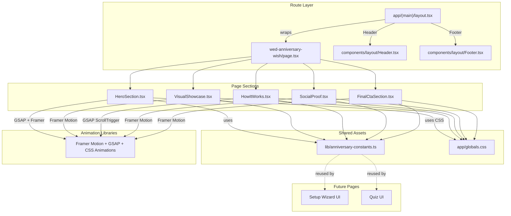

# Anniversary Quiz Landing Page — Architectural Plan

## Overview

Build a premium, mobile-first landing page for **WedInviter Anniversary Quiz** at route `/wed-anniversary-wish/`. This converts visitors into paying customers (₹399 one-time) for a personalized relationship quiz product.

---

## Route & Layout Strategy

| Aspect       | Decision                                                                                                                                                                     |
| ------------ | ---------------------------------------------------------------------------------------------------------------------------------------------------------------------------- |
| **Route**    | `app/(main)/wed-anniversary-wish/page.tsx` — uses the existing `(main)` layout group                                                                                         |
| **Layout**   | Inherits [`app/(main)/layout.tsx`](<app/(main)/layout.tsx>) which automatically provides [`Header`](components/layout/Header.tsx) + [`Footer`](components/layout/Footer.tsx) |
| **Metadata** | Page-level `generateMetadata` export with unique OG tags, title, description for the anniversary quiz product                                                                |
| **SEO**      | Canonical URL: `wedinviter.wasleen.com/wed-anniversary-wish/`; structured data for product (Quiz, ₹399)                                                                      |

### Why `(main)` group?

- Avoids layout duplication (Header/Footer already exist with premium bridal gradients, gold accents, WhatsApp contact)
- The existing [`Footer`](components/layout/Footer.tsx) already contains Copyright, Privacy Policy, Terms of Service, and Contact — matches all footer requirements
- Existing [`Header`](components/layout/Header.tsx) has gradient nav links and CTA button — brand consistency

---

## Design System Reuse

### Existing CSS Variables (from [`app/globals.css`](app/globals.css:3))

```css
/* Core palette */
--color-cream: #fbf7f0;
--color-blush: #fff5f5;
--color-champagne: #f7e7ce;
--color-magenta: #c0185f;
--color-rose: #e8638c;
--color-gold: #c9a962;
--color-deep-gold: #a8720a;
--color-charcoal: #2d2d2d;

/* Typography */
--font-cormorant  (display/headings — serif)
--font-inter      (body — sans-serif)
```

### New Utility Classes to Add (in `globals.css` or scoped `style` tags)

| Class / Keyframe             | Purpose                                                             |
| ---------------------------- | ------------------------------------------------------------------- |
| `@keyframes heartbeat-pulse` | CTA button gentle scale 1.0 → 1.05 with soft golden glow (CSS only) |
| `@keyframes petal-drift`     | Floating golden petal particles in hero                             |
| `.anniversary-gradient-text` | Gradient text fill for headings (rose → gold → champagne)           |
| `.anniversary-hero-bg`       | Radial gradient background (blush → champagne → cream)              |
| `.anniversary-cta-btn`       | Animated gradient CTA with heartbeat + golden glow box-shadow       |

---

## Component Tree

```
app/(main)/wed-anniversary-wish/
  └── page.tsx                  ← Page shell, imports all sections, metadata

components/anniversary/
  ├── HeroSection.tsx           ← Full-screen hero with floral background
  ├── VisualShowcase.tsx        ← Floating mockup carousel of 3 quiz phases
  ├── HowItWorks.tsx            ← Vertical staggered 3-step process
  ├── SocialProof.tsx           ← Features grid (3 cards)
  └── FinalCtaSection.tsx       ← Final CTA + minimal footer extras
```

---

## Section-by-Section Specification

### 1. HeroSection — `components/anniversary/HeroSection.tsx`

**Visual Layout (mobile-first):**

```
┌─────────────────────────────────┐
│   ✦  Floating golden petals     │
│      (GSAP/Framer animated)     │
│                                 │
│   "Celebrate Your Love with     │
│    a Personalized Anniversary   │
│    Quiz"                        │  ← Cormorant, gradient text
│                                 │
│   "Test how well they know you. │
│    Create a magical, interactive│  ← Inter, ~55% opacity
│    memory in just 5 minutes."   │
│                                 │
│  ┌─────────────────────────┐    │
│  │  Create Your Anniversary│    │  ← CTA button, heartbeat
│  │  Quiz                   │    │     pulse + golden glow
│  └─────────────────────────┘    │
│                                 │
│  Only ₹399 • One-time payment • │  ← Small, trust-building
│  No hidden fees                 │
└─────────────────────────────────┘
```

**Technical Specs:**

- Full `min-h-screen` with `dvh` units for true mobile viewport
- Background: soft radial gradient (`blush → champagne → cream`) with floating golden petal particles (Framer Motion `motion.div` with randomized `y` + `rotate` animations)
- Headline: [`font-[--font-cormorant]`], `text-[clamp(2.2rem,6vw,3.8rem)]`, gradient text using `anniversary-gradient-text` class with `bridal-shimmer` animation (already defined in globals.css)
- Subheadline: `text-base` Inter, `text-[--color-charcoal]/55`
- CTA: Large tap target (`h-14`), uses existing `cta-gradient-btn` class (from globals.css:254) PLUS a new heartbeat animation. Wrapped in `<Link href="/order">` (reuses order flow for now)
- Price/Trust label: `text-xs`, `text-[--color-charcoal]/45`, flex row with dots
- Scroll indicator: subtle chevron at bottom (Framer Motion fade)

**Animations:**

1. Headline: GSAP character stagger (like existing [`Hero.tsx`](components/home/Hero.tsx:90-108) but for anniversary text)
2. Subheadline + CTA: Framer Motion `fadeInUp` with `useInView`
3. CTA heartbeat: CSS `@keyframes heartbeat-pulse` — `scale(1) → scale(1.05)` with golden `box-shadow` glow, infinite 2s loop
4. Petal particles: Framer Motion `animate` with random `y` oscillation + rotation, staggered delays

---

### 2. VisualShowcase — `components/anniversary/VisualShowcase.tsx`

**Visual Layout:**

```
┌─────────────────────────────────┐
│  See the magic in action        │  ← Section label (gold, uppercase)
│                                 │
│  A Glimpse of Your Quiz         │  ← Cormorant heading
│                                 │
│  ┌──────┐  ┌──────┐  ┌──────┐  │
│  │  "To │  │"What │  │ Love │  │  ← 3 floating phone mockups
│  │ My   │  │ is   │  │ Level│  │     staggered horizontally
│  │ Love"│  │ my   │  │  95% │  │     (horizontal scroll on mobile)
│  └──────┘  └──────┘  └──────┘  │
│                                 │
│  Phase 1   Phase 2    Phase 3   │  ← Labels below each
│  Entrance   Quiz UI   Results   │
└─────────────────────────────────┘
```

**Technical Specs:**

- Section background: `bg-[--color-blush]`
- Heading: `font-[--font-cormorant]`, `text-[clamp(1.8rem,4vw,2.8rem)]`
- 3 phone-like cards (each `rounded-3xl`, `max-w-[260px]`, `aspect-[9/16]` on desktop, smaller on mobile)
- Each card has: a gradient placeholder background (simulating the quiz screen), a decorative border ring, and text overlay
- On mobile: horizontal scroll snap (`overflow-x-auto snap-x snap-mandatory`)
- On tablet+: 3-column grid

**Animations:**

1. Cards float with staggered float animation (CSS `@keyframes` from globals.css)
2. Framer Motion `fadeInUp` on scroll reveal for each card

---

### 3. HowItWorks — `components/anniversary/HowItWorks.tsx`

**Visual Layout:**

```
┌─────────────────────────────────┐
│  How It Works                   │  ← Section label
│                                 │
│  Three simple steps to          │
│  surprise your partner          │  ← Cormorant heading
│                                 │
│  ┌──┐                           │
│  │01│ Customize                 │  ← Step number in gold circle
│  └──┘ "Enter your names,        │
│        upload a beautiful       │
│        photo, and pick..."      │
│        ──────                    │  ← Connecting line
│  ┌──┐                           │
│  │02│ Preview & Publish         │
│  └──┘ "See exactly how it       │
│        looks. Pay a simple      │
│        ₹399..."                 │
│        ──────                    │
│  ┌──┐                           │
│  │03│ Play & Share              │
│  └──┘ "Send the link to your    │
│        partner. Let them        │
│        play the quiz..."        │
└─────────────────────────────────┘
```

**Technical Specs:**

- Vertical timeline layout (mobile-optimized)
- Each step: circle step number `w-12 h-12 rounded-full bg-[--color-gold]/10 border border-[--color-gold]/30` with gold gradient number
- Connecting line: `w-px h-12 bg-gradient-to-b from-[--color-gold]/40 to-transparent`
- Content: step title in Cormorant bold, description in Inter regular
- Card wrapper: glass-feature-card style for each step

**Animations:**

1. GSAP `ScrollTrigger` with stagger — each step fades up + draws connecting line
2. Step numbers animate in with scale spring effect

---

### 4. SocialProof — `components/anniversary/SocialProof.tsx`

**Visual Layout:**

```
┌─────────────────────────────────┐
│  Why Couples Love This          │  ← Section label
│                                 │
│  ┌──────────┐ ┌──────────┐     │
│  │ No Apps  │ │ Reverse  │     │  ← 3 feature cards
│  │ to       │ │ Challenge│     │     in grid
│  │ Download │ │          │     │
│  └──────────┘ └──────────┘     │
│  ┌──────────────────────────┐  │
│  │ Shareable Results        │  │  ← Full width on mobile
│  │                          │  │
│  └──────────────────────────┘  │
└─────────────────────────────────┘
```

**Technical Specs:**

- 3 cards in responsive grid (`grid-cols-1 sm:grid-cols-2 lg:grid-cols-3`)
- Each card: icon (emoji/emoji-like large), title (Cormorant), description (Inter), glass-feature-card styling
- Icons: 📱 (No Apps), 🔄 (Reverse Challenge), 📸 (Shareable Results)
- Card colors: warm rose-gold palette matching the anniversary theme

**Animations:**

- Framer Motion `fadeInUp` stagger on scroll

---

### 5. FinalCtaSection — `components/anniversary/FinalCtaSection.tsx`

**Visual Layout:**

```
┌─────────────────────────────────┐
│  Ready to surprise your         │
│  dearest person?                │  ← Cormorant, large
│                                 │
│  ┌─────────────────────────┐    │
│  │  Start Building Your    │    │  ← Heartbeat CTA
│  │  Quiz                    │    │     (same style as Hero)
│  └─────────────────────────┘    │
│                                 │
│  Only ₹399 • One-time           │  ← Trust label
└─────────────────────────────────┘
```

**Technical Specs:**

- Full-width section with subtle gradient background
- Same CTA button style as Hero (reuse `anniversary-cta-btn` class)
- Trust label repeats the ₹399 message

---

## Page Shell — `app/(main)/wed-anniversary-wish/page.tsx`

```tsx
import type { Metadata } from "next";
import HeroSection from "@/components/anniversary/HeroSection";
import VisualShowcase from "@/components/anniversary/VisualShowcase";
import HowItWorks from "@/components/anniversary/HowItWorks";
import SocialProof from "@/components/anniversary/SocialProof";
import FinalCtaSection from "@/components/anniversary/FinalCtaSection";

export const metadata: Metadata = {
  title: "Anniversary Quiz — WedInviter",
  description:
    "Create a personalized anniversary quiz for your partner. Test how well they know you in just 5 minutes. ₹399 one-time.",
  openGraph: {
    title: "Celebrate Your Love with a Personalized Anniversary Quiz",
    description: "Create a magical, interactive memory in just 5 minutes.",
    url: "/wed-anniversary-wish/",
  },
};

export default function AnniversaryQuizPage() {
  return (
    <>
      <HeroSection />
      <VisualShowcase />
      <HowItWorks />
      <SocialProof />
      <FinalCtaSection />
    </>
  );
}
```

---

## Shared Constants File — `lib/anniversary-constants.ts`

Create a constants file for reuse across the Setup Wizard and Quiz UI pages:

```ts
export const ANNIVERSARY_PRICE = 399;
export const ANNIVERSARY_PRICE_DISPLAY = "₹399";
export const ANNIVERSARY_ROUTE = "/wed-anniversary-wish";
export const ANNIVERSARY_SETUP_ROUTE = "/order?type=anniversary-quiz";

export const ANNIVERSARY_COLORS = {
  primary: "#c0185f", // magenta
  secondary: "#e8638c", // rose
  accent: "#c9a962", // gold
  light: "#f7e7ce", // champagne
  bg: "#fff5f5", // blush
} as const;

export const ANNIVERSARY_FEATURES = [
  {
    icon: "📱",
    title: "No Apps to Download",
    desc: "Works instantly in any mobile browser. Just share the link.",
  },
  {
    icon: "🔄",
    title: "Reverse Challenge",
    desc: "Once they finish, they can challenge you back! Double the fun.",
  },
  {
    icon: "📸",
    title: "Shareable Results",
    desc: "Gorgeous Love Level scorecards designed for Instagram & WhatsApp stories.",
  },
] as const;
```

---

## CSS Additions to `app/globals.css`

Add these new keyframes and utility classes:

```css
/* ── Anniversary Quiz: Heartbeat pulse for CTA ────────────── */
@keyframes heartbeat-pulse {
  0%,
  100% {
    transform: scale(1);
    box-shadow: 0 0 0 0 rgba(201, 169, 98, 0.4);
  }
  25% {
    transform: scale(1.03);
    box-shadow: 0 0 20px 6px rgba(201, 169, 98, 0.25);
  }
  50% {
    transform: scale(1.05);
    box-shadow: 0 0 35px 12px rgba(201, 169, 98, 0.15);
  }
  75% {
    transform: scale(1.03);
    box-shadow: 0 0 20px 6px rgba(201, 169, 98, 0.25);
  }
}

.anniversary-heartbeat-btn {
  animation: heartbeat-pulse 2.5s ease-in-out infinite;
}

/* ── Anniversary Quiz: Gradient heading text ──────────────── */
.anniversary-gradient-text {
  background: linear-gradient(
    135deg,
    #e8638c 0%,
    #c0185f 25%,
    #c9a962 50%,
    #f7e7ce 70%,
    #c9a962 100%
  );
  background-size: 300% 300%;
  -webkit-background-clip: text;
  background-clip: text;
  -webkit-text-fill-color: transparent;
  color: transparent;
  animation: bridal-shimmer 6s ease-in-out infinite;
}

/* ── Anniversary Quiz: Petal drift keyframe ──────────────── */
@keyframes petal-drift {
  0% {
    transform: translateY(0) rotate(0deg) scale(1);
    opacity: 0;
  }
  10% {
    opacity: 0.6;
  }
  90% {
    opacity: 0.3;
  }
  100% {
    transform: translateY(-120vh) rotate(720deg) scale(0.4);
    opacity: 0;
  }
}
```

---

## Animation Strategy Summary

| Section         | Technique                                 | Library                 |
| --------------- | ----------------------------------------- | ----------------------- |
| Hero headline   | Character stagger entrance                | GSAP                    |
| Hero petals     | Floating particles with random y + rotate | Framer Motion           |
| Hero CTA        | Heartbeat pulse (scale + glow)            | CSS keyframes           |
| Visual Showcase | Scroll-triggered fade-up + float          | Framer Motion + CSS     |
| How It Works    | Staggered fade-up + timeline draw         | GSAP ScrollTrigger      |
| Social Proof    | Staggered fade-up                         | Framer Motion useInView |
| Final CTA       | Fade-up on scroll                         | Framer Motion           |

---

## Implementation Order

| Step | Component                             | Depends On |
| ---- | ------------------------------------- | ---------- |
| 1    | Add CSS utilities to `globals.css`    | Nothing    |
| 2    | Create `lib/anniversary-constants.ts` | Nothing    |
| 3    | Create page shell with metadata       | Step 1     |
| 4    | Build `HeroSection.tsx`               | Steps 1, 2 |
| 5    | Build `VisualShowcase.tsx`            | Step 1     |
| 6    | Build `HowItWorks.tsx`                | Step 1     |
| 7    | Build `SocialProof.tsx`               | Steps 1, 2 |
| 8    | Build `FinalCtaSection.tsx`           | Steps 1, 2 |
| 9    | Wire all into page.tsx                | Steps 3—8  |
| 10   | Verification & polish                 | Step 9     |

---

## Architecture Diagram



---

## Mobile-First Checklist

- [ ] All sections use `min-h-screen-dvh` or equivalent for true mobile viewport
- [ ] Text sizes use `clamp()` for fluid scaling
- [ ] Tap targets ≥ 44px (CTA buttons are `h-14` = 56px)
- [ ] Horizontal scroll on Visual Showcase for mobile (snap points)
- [ ] Vertical timeline on HowItWorks collapses cleanly on small screens
- [ ] Grid columns collapse to single column on mobile
- [ ] Edge-to-edge full bleed (no horizontal padding on outermost containers)
- [ ] Font rendering: `-webkit-font-smoothing: antialiased` already in layout
