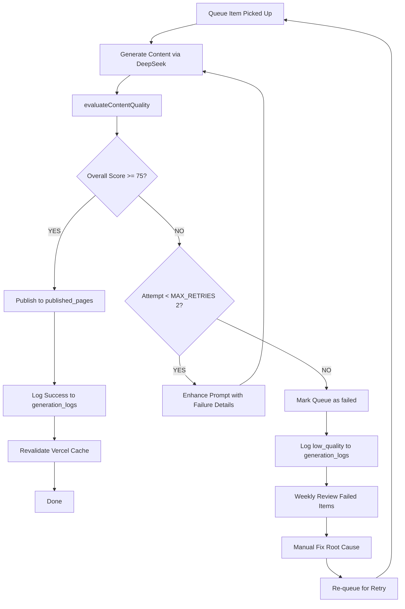

# Pseo Quality Control

## Objective

Ensure every published page meets strict quality standards before going live, continuously monitor page quality post-publication, and automatically flag/regenerate low-quality or stale content. The system enforces a **6-dimension weighted scoring model** with a **minimum threshold of 75/100**, automated regeneration up to 2 retries, and weekly manual spot-checks.

## Input Parameters

### QualityScores Interface

```typescript
interface QualityScores {
  overall: number; // Weighted composite score (0-100)
  location_specificity: number; // Location name density score (0-100)
  cultural_relevance: number; // Cultural keyword frequency score (0-100)
  actionability: number; // Action-oriented keyword score (0-100)
  readability: number; // Structure completeness score (0-100)
  keyword_optimization: number; // Target keyword placement score (0-100)
  uniqueness: number; // Content element variety score (0-100)
}
```

### QueueItem Interface (Source Data)

```typescript
interface QueueItem {
  queue_id: number;
  location_name: string;
  location_slug: string;
  topic_name: string;
  topic_slug: string;
  subtopic_name: string | null;
  subtopic_slug: string | null;
  target_keyword: string;
  url_slug: string;
  priority_score: number;
  cultural_context: string | null;
}
```

### GeneratedContent Interface (What Gets Scored)

```typescript
interface GeneratedContent {
  title: string;
  meta_description: string;
  h1: string;
  intro: { hook: string; context: string; preview: string };
  benefits: Array<{ title: string; description: string; icon: string }>;
  main_content: Array<{
    heading: string;
    content: string;
    subsections?: Array<{ subheading: string; content: string }>;
  }>;
  local_insights: {
    popular_venues?: string[];
    best_seasons?: string;
    average_costs?: string;
    cultural_customs?: string;
  };
  vendor_recommendations?: Array<{
    category: string;
    tips: string;
    price_range: string;
  }>;
  faqs: Array<{ question: string; answer: string }>;
  testimonials?: Array<{
    name: string;
    location: string;
    quote: string;
    rating: number;
  }>;
  pricing_table?: {
    packages: Array<{ name: string; price: string; features: string[] }>;
  };
  cta: {
    heading: string;
    description: string;
    button_text: string;
    features: string[];
  };
  related_topics: Array<{ title: string; url: string }>;
}
```

---

## 6-Dimension Quality Scoring System

The quality evaluation function [`evaluateContentQuality()`](plans/pSEO%20for%20Wedinviter.wasleen.com/generate-wedding-content.ts:349) computes 6 dimension scores and a weighted overall score. Each dimension is scored **0-100**, then combined via a weighted formula.

### Formula

```python
quality_score = (
  (location_specificity × 0.20) +
  (cultural_relevance    × 0.15) +
  (actionability         × 0.15) +
  (readability           × 0.15) +
  (keyword_optimization  × 0.15) +
  (uniqueness            × 0.20)
)
```

### Dimension 1: Location Specificity (Weight: 20%)

**Purpose**: Ensures content is genuinely about the target location, not generic.

**Scoring Logic** (from [`generate-wedding-content.ts:356-358`](plans/pSEO%20for%20Wedinviter.wasleen.com/generate-wedding-content.ts:356)):

```typescript
const locationMentions = (
  contentText.match(new RegExp(locationName, "g")) || []
).length;
const locationSpecificity = Math.min(100, (locationMentions / 15) * 100);
```

| Mentions | Score | Interpretation                              |
| -------- | ----- | ------------------------------------------- |
| ≥15      | 100   | Excellent location density                  |
| 10-14    | 67-93 | Good — adequate local relevance             |
| 5-9      | 33-60 | Fair — risk of being generic                |
| <5       | <33   | POOR — page is not location-specific enough |

**Benchmark**: Target **15+ mentions** of the location name for a perfect score. This includes all location name occurrences in title, h1, meta_description, intro, benefits, main_content, local_insights, FAQs, and CTA.

---

### Dimension 2: Cultural Relevance (Weight: 15%)

**Purpose**: Ensures content acknowledges regional wedding traditions, religions, and customs.

**Scoring Logic** (from [`generate-wedding-content.ts:361-366`](plans/pSEO%20for%20Wedinviter.wasleen.com/generate-wedding-content.ts:361)):

```typescript
const culturalKeywords = ['tradition', 'custom', 'ritual', 'culture', 'hindu', 'muslim', 'christian', 'sikh'];
const culturalMentions = culturalKeywords.reduce(...);
const culturalRelevance = Math.min(100, (culturalMentions / 8) * 100);
```

| Keywords Found | Score | Interpretation                   |
| -------------- | ----- | -------------------------------- |
| ≥8             | 100   | Excellent cultural coverage      |
| 5-7            | 63-88 | Good                             |
| 3-4            | 38-50 | Fair — add more cultural context |
| <3             | <38   | POOR — culturally generic        |

**Keyword Reference**:

- `tradition` — Wedding traditions specific to location
- `custom` — Local wedding customs and practices
- `ritual` — Wedding rituals (saat phere, nikah, etc.)
- `culture` — Cultural significance of marriage
- `hindu` — Hindu wedding elements
- `muslim` — Muslim/Islamic wedding elements
- `christian` — Christian wedding elements
- `sikh` — Sikh/Anand Karaj wedding elements

**Rule**: Always match cultural keywords to location context (e.g., Kerala pages should mention `hindu` and `christian`; Punjab pages should mention `sikh`).

---

### Dimension 3: Actionability (Weight: 15%)

**Purpose**: Ensures content helps users take action — plan, book, choose, create.

**Scoring Logic** (from [`generate-wedding-content.ts:369-374`](plans/pSEO%20for%20Wedinviter.wasleen.com/generate-wedding-content.ts:369)):

```typescript
const actionableKeywords = ['how to', 'steps', 'tips', 'guide', 'choose', 'find', 'book'];
const actionableMentions = actionableKeywords.reduce(...);
const actionability = Math.min(100, (actionableMentions / 10) * 100);
```

| Keywords Found | Score | Interpretation                         |
| -------------- | ----- | -------------------------------------- |
| ≥10            | 100   | Excellent action guidance              |
| 7-9            | 70-90 | Good                                   |
| 4-6            | 40-60 | Fair                                   |
| <4             | <40   | POOR — not helpful for decision-making |

**Benchmark**: Every page should include sections like "How to Choose", "Steps to Book", "Tips for Planning" that naturally contain action keywords.

---

### Dimension 4: Readability (Weight: 15%)

**Purpose**: Ensures content has complete, well-structured sections for good user experience.

**Scoring Logic** (from [`generate-wedding-content.ts:377-389`](plans/pSEO%20for%20Wedinviter.wasleen.com/generate-wedding-content.ts:377)):

```typescript
const hasIntro = content.intro && content.intro.hook && content.intro.context; // 25 pts
const hasBenefits = content.benefits && content.benefits.length >= 5; // 20 pts
const hasMainContent = content.main_content && content.main_content.length >= 6; // 30 pts
const hasFAQs = content.faqs && content.faqs.length >= 10; // 15 pts
const hasCTA = content.cta && content.cta.heading; // 10 pts

const readability =
  (hasIntro ? 25 : 0) +
  (hasBenefits ? 20 : 0) +
  (hasMainContent ? 30 : 0) +
  (hasFAQs ? 15 : 0) +
  (hasCTA ? 10 : 0);
```

| Score | Structure Completeness  | Missing Elements            |
| ----- | ----------------------- | --------------------------- |
| 100   | All 5 sections complete | None                        |
| 85    | 4 of 5 complete         | 1 section missing           |
| 60    | 3 of 5 complete         | 2 sections missing          |
| 25-40 | 1-2 of 5 complete       | 3-4 sections missing        |
| 0     | No complete sections    | All sections missing/broken |

**Section Requirements**:

| Section      | Points | Minimum Requirement                        |
| ------------ | ------ | ------------------------------------------ |
| Intro        | 25     | `hook` + `context` both present            |
| Benefits     | 20     | ≥5 benefit items with title + description  |
| Main Content | 30     | ≥6 content sections with heading + content |
| FAQs         | 15     | ≥10 FAQ items with question + answer       |
| CTA          | 10     | `heading` present                          |

**Common Failure**: FAQ items missing question or answer field → all FAQs count as absent. Main content items missing `content` field → count as absent.

---

### Dimension 5: Keyword Optimization (Weight: 15%)

**Purpose**: Ensures the target keyword appears in critical SEO positions.

**Scoring Logic** (from [`generate-wedding-content.ts:392-399`](plans/pSEO%20for%20Wedinviter.wasleen.com/generate-wedding-content.ts:392)):

```typescript
const titleHasKeyword = content.title.toLowerCase().includes(targetKeyword)
  ? 30
  : 0;
const h1HasKeyword = content.h1.toLowerCase().includes(targetKeyword) ? 30 : 0;
const introHasKeyword = content.intro?.hook
  ?.toLowerCase()
  .includes(targetKeyword)
  ? 20
  : 0;
const bodyMentions = (
  contentText.match(new RegExp(targetKeyword.replace(/ /g, ".*"), "g")) || []
).length;
const bodyScore = Math.min(20, bodyMentions * 5);

const keywordOptimization =
  titleHasKeyword + h1HasKeyword + introHasKeyword + bodyScore;
```

| Placement  | Points | Requirement                             |
| ---------- | ------ | --------------------------------------- |
| Title      | 30     | Target keyword appears in `<title>` tag |
| H1         | 30     | Target keyword appears in `h1_heading`  |
| Intro Hook | 20     | Target keyword appears in intro hook    |
| Body       | 20     | ≥4 body mentions of target keyword      |

**Keyword Placement Audit Table**:

| Element       | Points | Present? | Check                                        |
| ------------- | ------ | -------- | -------------------------------------------- |
| Title keyword | 30     | ✅/❌    | `content.title.includes(targetKeyword)`      |
| H1 keyword    | 30     | ✅/❌    | `content.h1.includes(targetKeyword)`         |
| Hook keyword  | 20     | ✅/❌    | `content.intro.hook.includes(targetKeyword)` |
| Body mentions | 20     | ✅/❌    | ≥4 regex matches in full content JSON string |

**Warning**: If the keyword is multi-word (e.g., "digital wedding invitations in Mumbai"), the regex uses `.*` between words — ensure the generated content uses the exact phrase without excessive word insertion.

---

### Dimension 6: Uniqueness (Weight: 20%)

**Purpose**: Ensures content has diverse, location-specific elements that differentiate it from other pages.

**Scoring Logic** (from [`generate-wedding-content.ts:402-410`](plans/pSEO%20for%20Wedinviter.wasleen.com/generate-wedding-content.ts:402)):

```typescript
const uniquenessFactors = [
  content.local_insights?.popular_venues?.length || 0,
  content.local_insights?.best_seasons ? 20 : 0,
  content.local_insights?.average_costs ? 20 : 0,
  content.local_insights?.cultural_customs ? 20 : 0,
  content.vendor_recommendations?.length || 0 * 10,
  content.testimonials?.length || 0 * 10,
];
const uniqueness = Math.min(
  100,
  uniquenessFactors.reduce((a, b) => a + b, 0),
);
```

| Factor           | Max Points | Requirement                                     |
| ---------------- | ---------- | ----------------------------------------------- |
| Popular Venues   | Up to 40   | Each venue listed = points (capped at 40)       |
| Best Seasons     | 20         | `local_insights.best_seasons` is present        |
| Average Costs    | 20         | `local_insights.average_costs` is present       |
| Cultural Customs | 20         | `local_insights.cultural_customs` is present    |
| Vendor Recs      | Up to 40   | Each vendor category = 10 points (capped at 40) |
| Testimonials     | Up to 40   | Each testimonial = 10 points (capped at 40)     |

**Note**: The TypeScript code has a bug — `vendor_recommendations?.length || 0 * 10` and `testimonials?.length || 0 * 10` evaluate `(0 * 10)` as 0 due to operator precedence. The actual computed value is `length` (not `length * 10`). When implementing, ensure the multiplier applies correctly: `(content.vendor_recommendations?.length || 0) * 10`.

**Ideal Uniqueness Profile**: 3+ venues, seasons + costs + customs present, 3+ vendor categories, 2+ testimonials = 100 points.

---

## Quality Thresholds & Page Grading

### Threshold Matrix

| Grade        | Score Range | Action                                                                    |
| ------------ | ----------- | ------------------------------------------------------------------------- |
| 🟢 Excellent | 90-100      | Publish immediately (no changes needed)                                   |
| 🟡 Good      | 80-89       | Publish (acceptable quality)                                              |
| 🟠 Fair      | 75-79       | Publish with monitoring flag (check within 7 days)                        |
| 🔴 Poor      | 70-74       | Regenerate with enhanced prompt (retry 1)                                 |
| ⛔ Critical  | <70         | Regenerate with enhanced prompt (retry 1); if still <70, fail permanently |

### Minimum Requirements (Hard Gates)

Before quality scoring even runs, these minimum requirements must be met:

| Requirement       | Threshold                    | Check Method                                  |
| ----------------- | ---------------------------- | --------------------------------------------- |
| Word count        | 2,000-2,500 words            | `JSON.stringify(content).split(/\s+/).length` |
| Originality       | 100% (no AI detection flags) | Manual spot-check + AI detection tool         |
| Location details  | 8-12 specific details        | `local_insights` field inspection             |
| Cultural insights | 5-7 insights                 | Manual review                                 |
| FAQ count         | 10-15 items                  | `content.faqs.length >= 10`                   |
| Internal links    | 3-5 links                    | `content.related_topics.length >= 3`          |
| External links    | 1-2 authoritative links      | Manual review                                 |
| Quality score     | ≥75/100                      | `evaluateContentQuality()` result             |

---

## Pre-Publication Quality Gate

### Automated Gate Flow

```
Generate Content → Evaluate Quality → Score ≥ 75? → YES → Publish
                                         ↓ NO
                              Attempt < MAX_RETRIES (2)?
                                         ↓
                                  YES → Regenerate with Enhanced Prompt →
                                  NO  → Mark queue item as 'failed'
                                         Log error: "Low quality: {score}/100"
```

### Implementation (from [`generate-wedding-content.ts:682-699`](plans/pSEO%20for%20Wedinviter.wasleen.com/generate-wedding-content.ts:682)):

```typescript
// Check if quality meets threshold
if (qualityScores.overall < CONFIG.MIN_QUALITY_SCORE) {
  // MIN_QUALITY_SCORE = 75
  await logGeneration(item.queue_id, "low_quality", qualityScores.overall);

  if (attempt < CONFIG.MAX_RETRIES) {
    // MAX_RETRIES = 2
    // Regenerate with enhanced prompt (attempt + 1)
    return processQueueItem(item, attempt + 1);
  }

  // Mark as permanently failed
  await supabase
    .from("content_queue")
    .update({
      status: "failed",
      last_error: `Low quality: ${qualityScores.overall}/100`,
    })
    .eq("id", item.queue_id);

  return false;
}
```

### Enhanced Prompt Strategy (on Retry)

When regenerating a low-quality page, the prompt must be enhanced with specific quality failure feedback:

| Failed Dimension     | Prompt Enhancement                                                                                                                                                                                                                                                                          |
| -------------------- | ------------------------------------------------------------------------------------------------------------------------------------------------------------------------------------------------------------------------------------------------------------------------------------------- |
| Location Specificity | Add: "IMPORTANT: Mention [Location Name] at least 15 times across the entire article. Every section must reference [Location Name] specifically."                                                                                                                                           |
| Cultural Relevance   | Add: "CRITICAL: Include specific cultural details about [location]'s wedding traditions. Mention relevant religious customs (Hindu/Muslim/Christian/Sikh practices specific to this region)."                                                                                               |
| Actionability        | Add: "Ensure every section provides actionable advice. Use phrases like 'how to', 'steps to', 'tips for', 'guide to' throughout the content."                                                                                                                                               |
| Readability          | Add: "Structure is mandatory: (1) compelling intro with hook and context, (2) at least 5 benefits, (3) at least 6 main content sections, (4) at least 10 FAQs, (5) strong CTA."                                                                                                             |
| Keyword Optimization | Add: "CRITICAL: The target keyword '[target_keyword]' MUST appear in: title, H1 heading, first paragraph hook, and at least 4 times in body content."                                                                                                                                       |
| Uniqueness           | Add: "You MUST include: (1) at least 3 popular venues/functions specific to [location], (2) best wedding seasons in [location], (3) average wedding costs, (4) cultural customs unique to [location], (5) vendor categories with tips, (6) realistic testimonials from [location] couples." |

### Queue Status Lifecycle for Quality

| Status       | Meaning                | Trigger                              |
| ------------ | ---------------------- | ------------------------------------ |
| `pending`    | Waiting in queue       | Initial insert                       |
| `generating` | Being processed        | Queue worker picks up                |
| `completed`  | Published successfully | Quality score ≥ 75                   |
| `failed`     | Permanently failed     | Quality score < 75 after MAX_RETRIES |

### Logging Quality Failures

Each generation attempt is logged to [`generation_logs`](plans/pSEO%20for%20Wedinviter.wasleen.com/generate-wedding-content.ts:615) table:

```typescript
await logGeneration(queueId, "low_quality", qualityScore);
// Or on success:
await logGeneration(
  queueId,
  "success",
  qualityScore,
  undefined,
  tokensUsed,
  generationTime,
);
```

### Configuration Constants

```
MIN_QUALITY_SCORE = 75     // Minimum acceptable overall score
MAX_RETRIES       = 2      // Maximum regeneration attempts before permanent failure
```

---

## Post-Publication Monitoring

### Content Quality Metrics Targets

| Metric                     | Target      | Measurement                                 |
| -------------------------- | ----------- | ------------------------------------------- |
| Generation Success Rate    | >95%        | `success / total` from `generation_logs`    |
| Average Quality Score      | ≥80/100     | `AVG(quality_score)` from `published_pages` |
| Pages Needing Regeneration | <5%         | Pages with score < 75 / total pages         |
| Average Word Count         | 2,200 words | `AVG(word_count)` from `published_pages`    |

### Daily Quality Dashboard (SQL)

Run this query daily to monitor quality distribution:

```sql
SELECT
  COUNT(*) AS total_pages,
  ROUND(AVG(quality_score), 1) AS avg_quality,
  COUNT(*) FILTER (WHERE quality_score >= 90) AS excellent,
  COUNT(*) FILTER (WHERE quality_score BETWEEN 80 AND 89) AS good,
  COUNT(*) FILTER (WHERE quality_score BETWEEN 75 AND 79) AS fair,
  COUNT(*) FILTER (WHERE quality_score < 75) AS poor,
  ROUND(AVG(word_count), 0) AS avg_word_count
FROM published_pages;
```

### Bottom-N Pages Query

Identify the worst-performing pages for regeneration priority:

```sql
SELECT
  url_path,
  title,
  quality_score,
  location_specificity_score,
  cultural_relevance_score,
  actionability_score,
  word_count,
  created_at
FROM published_pages
ORDER BY quality_score ASC
LIMIT 20;
```

### Dimension Weakness Analysis

Analyze which dimension is dragging scores down across all pages:

```sql
SELECT
  ROUND(AVG(location_specificity_score), 1) AS avg_location,
  ROUND(AVG(cultural_relevance_score), 1) AS avg_cultural,
  ROUND(AVG(actionability_score), 1) AS avg_actionability,
  ROUND(AVG(quality_score), 1) AS avg_overall
FROM published_pages
WHERE created_at >= NOW() - INTERVAL '7 days';
```

### Weekly Manual Spot-Checks

As per risk mitigation (from mega plan), perform manual spot-checks on **10 pages per week**:

1. **Random Selection**: Use SQL to randomly sample 10 pages published in the last 7 days:

   ```sql
   SELECT url_path, title, quality_score, created_at
   FROM published_pages
   WHERE created_at >= NOW() - INTERVAL '7 days'
   ORDER BY RANDOM()
   LIMIT 10;
   ```

2. **Manual Review Checklist** (for each of the 10 pages):

   | Check                                       | Pass/Fail | Notes |
   | ------------------------------------------- | --------- | ----- |
   | Is content genuinely about the location?    | ✅/❌     |       |
   | Are cultural references accurate?           | ✅/❌     |       |
   | Is pricing/venue info realistic?            | ✅/❌     |       |
   | Are FAQs actually answering real questions? | ✅/❌     |       |
   | Does the page feel AI-generated/spammy?     | ✅/❌     |       |
   | Are internal links working?                 | ✅/❌     |       |
   | Is the CTA relevant and compelling?         | ✅/❌     |       |
   | Would a real user find this helpful?        | ✅/❌     |       |

3. **If ≥2 of 10 pages fail**: Raise alert, investigate root cause (prompt issue, location data issue, etc.), trigger bulk regeneration for affected topic/location combination.

---

## Content Freshness & Regeneration Rules

### Staleness Schedule

| Page Quality Score                     | Refresh After | Trigger                                    |
| -------------------------------------- | ------------- | ------------------------------------------ |
| ≥90 (Excellent)                        | 180 days      | Score still valid — minimal refresh        |
| 80-89 (Good)                           | 120 days      | Medium priority refresh                    |
| 75-79 (Fair)                           | 90 days       | High priority refresh — flagged at publish |
| <75 (Poor — should never be published) | N/A           | Should have been caught by gate            |

### Automated Freshness Check

Run this weekly to identify pages requiring refresh:

```sql
SELECT
  p.id,
  p.url_path,
  p.title,
  p.quality_score,
  p.created_at,
  CASE
    WHEN p.quality_score >= 90 AND p.created_at < NOW() - INTERVAL '180 days' THEN 'refresh_needed'
    WHEN p.quality_score BETWEEN 80 AND 89 AND p.created_at < NOW() - INTERVAL '120 days' THEN 'refresh_needed'
    WHEN p.quality_score BETWEEN 75 AND 79 AND p.created_at < NOW() - INTERVAL '90 days' THEN 'refresh_needed'
    ELSE 'ok'
  END AS freshness_status
FROM published_pages p
WHERE p.created_at < NOW() - INTERVAL '90 days'
ORDER BY p.created_at ASC;
```

### Regeneration Workflow for Stale Pages

1. Query stale pages (using above SQL)
2. Re-insert into `content_queue` with `priority_score = 100` (high priority)
3. Set `status = 'pending'` and `last_error = 'scheduled_refresh'`
4. Let the daily generation workflow process them
5. On successful regeneration, the new page replaces the old one via `url_path` uniqueness constraint

---

## Duplicate Detection

### Prevent Duplicates at Database Level

The [`published_pages`](plans/pSEO%20for%20Wedinviter.wasleen.com/generate-wedding-content.ts:532) table enforces URL uniqueness:

```sql
url_path VARCHAR(500) UNIQUE NOT NULL,  -- Prevents duplicate URL insertion
```

### Content Similarity Detection

Run this query to detect pages with suspiciously similar titles (potential duplicate content):

```sql
SELECT
  a.url_path AS page_a,
  b.url_path AS page_b,
  a.title AS title_a,
  b.title AS title_b,
  a.quality_score AS score_a,
  b.quality_score AS score_b
FROM published_pages a
JOIN published_pages b ON a.id < b.id
WHERE a.topic_slug = b.topic_slug  -- Same pillar
  AND a.location_slug != b.location_slug  -- Different location
  AND SIMILARITY(a.title, b.title) > 0.8;  -- pg_trgm similarity threshold
```

**Note**: This requires the `pg_trgm` extension. Install with:

```sql
CREATE EXTENSION IF NOT EXISTS pg_trgm;
```

### Duplicate Content Prevention Rules

| Rule                                                                   | Enforcement                                  |
| ---------------------------------------------------------------------- | -------------------------------------------- |
| No two pages can have the same `url_path`                              | Database `UNIQUE` constraint                 |
| Same topic across different locations should differ by ≥20% in content | Quality scoring (uniqueness dimension)       |
| Same location across different topics should differ by ≥30% in content | Prompt design ensures topic-specific content |
| Identical or near-identical meta descriptions flagged                  | Manual spot-check                            |

---

## Keyword Stuffing Detection

### Detection Logic

While the quality scoring system's keyword optimization rewards keyword presence, stuffing is penalized. Implement this post-scoring check:

```typescript
function detectKeywordStuffing(
  content: GeneratedContent,
  targetKeyword: string,
): boolean {
  const contentText = JSON.stringify(content).toLowerCase();
  const keyword = targetKeyword.toLowerCase();

  // Count all occurrences
  const regex = new RegExp(keyword.replace(/ /g, "\\s+"), "g");
  const matches = contentText.match(regex);
  const count = matches ? matches.length : 0;

  // Calculate keyword density
  const wordCount = contentText.split(/\s+/).length;
  const density = (count * keyword.split(/\s+/).length) / wordCount;

  // Flag if density > 3%
  return density > 0.03;
}
```

### Stuffing Thresholds

| Density | Verdict               | Action                      |
| ------- | --------------------- | --------------------------- |
| <1.5%   | Natural               | No action needed            |
| 1.5%-3% | Acceptable            | Acceptable SEO optimization |
| **>3%** | **STUFFING DETECTED** | **Flag for regeneration**   |

### When Stuffing Is Detected

1. Log a warning in `generation_logs` with `status = 'keyword_stuffing'`
2. Regenerate the page with a prompt enhancement: "WARNING: Do not overuse the keyword '[target_keyword]'. Use natural variations and synonyms. Maximum density: 2%."
3. If quality score is still ≥75, publish anyway but flag for manual review
4. If quality score drops below 75 due to stuffing fix, follow standard regeneration flow

### Natural Keyword Variation Rules

Instead of repeating the exact target keyword, content should use these natural variations:

| Base Phrase                     | Variations                                                                                                                          |
| ------------------------------- | ----------------------------------------------------------------------------------------------------------------------------------- |
| "wedding invitations in [city]" | "[city] wedding cards", "e-invitations for [city] weddings", "[city] digital wedding invites", "wedding invitation cards in [city]" |
| "best wedding venues in [city]" | "[city] wedding venues", "top wedding locations in [city]", "popular marriage halls in [city]", "[city] banquet halls"              |
| "bridal makeup in [city]"       | "[city] bridal makeup artists", "wedding makeup in [city]", "bridal beauty services [city]"                                         |

---

## Readability Checks

### Beyond the Readability Score

The automated readability score (dimension 4) checks structure completeness. Additionally, perform these checks:

**Sentence Length Distribution**:

```typescript
function analyzeSentenceLength(content: GeneratedContent): {
  avg: number;
  long_sentences: number;
} {
  const text = extractTextFromContent(content);
  const sentences = text.split(/[.!?]+/).filter((s) => s.trim().length > 0);
  const lengths = sentences.map((s) => s.split(/\s+/).length);
  return {
    avg: lengths.reduce((a, b) => a + b, 0) / lengths.length,
    long_sentences: lengths.filter((l) => l > 30).length,
  };
}
```

| Metric                     | Target                | Warning                           |
| -------------------------- | --------------------- | --------------------------------- |
| Avg sentence length        | 15-25 words           | >30 words → flag                  |
| Long sentences (>30 words) | <10% of all sentences | >15% → flag                       |
| Paragraphs                 | 3-5 sentences each    | Single-sentence paragraphs → flag |

**Heading Density**:

- At least one heading every ~200 words
- H2s should be distributed evenly across content sections
- No section should go >400 words without a subheading

---

## Error Handling

### Quality Evaluation Failures

| Error Scenario                        | Handling                                                                          |
| ------------------------------------- | --------------------------------------------------------------------------------- |
| `content` is `null`                   | Log as `failed`, queue item marked `failed` with error "Generation returned null" |
| `content.intro` is missing            | Readability score = 0 for intro component (25pts lost)                            |
| `content.faqs` is empty array         | Readability score = 0 for FAQs (15pts lost)                                       |
| `content.local_insights` is undefined | Uniqueness score drops significantly (loses venues, seasons, costs, customs)      |
| `content.cta` is missing `heading`    | Readability loses 10pts                                                           |
| `content.benefits` has <5 items       | Readability loses 20pts                                                           |
| `content.main_content` has <6 items   | Readability loses 30pts                                                           |
| Target keyword not found anywhere     | Keyword optimization = 0 (100pts lost in that dimension)                          |

### Retry Escalation

If `processQueueItem()` fails after `MAX_RETRIES` (2), the queue item status becomes `failed` and `last_error` stores the reason. These failed items should be:

1. **Reviewed weekly**:
   ```sql
   SELECT * FROM content_queue WHERE status = 'failed' AND updated_at >= NOW() - INTERVAL '7 days';
   ```
2. **Manually triaged**: Fix the root cause (prompt, location data, etc.)
3. **Re-queued**: Update status to `pending` and clear `last_error`:
   ```sql
   UPDATE content_queue SET status = 'pending', last_error = NULL, updated_at = NOW()
   WHERE status = 'failed' AND id = {queue_id};
   ```

### Schema Validation Errors

If `publishContent()` fails due to schema mismatch (missing required fields), log detailed error:

```typescript
// From publishContent
catch (error) {
  console.error(`❌ Error in publishContent: ${error}`);
  return false;
}
```

Investigate immediately — schema errors indicate the AI response parser is broken.

---

## Quality Checklist (Pre-Publication)

### Automated Checks (Run by `evaluateContentQuality()`)

| #   | Check                         | Pass/Fail | Remediation                                                    |
| --- | ----------------------------- | --------- | -------------------------------------------------------------- |
| 1   | Location specificity ≥ 75/100 | ✅/❌     | Enhance prompt with location density instruction               |
| 2   | Cultural relevance ≥ 70/100   | ✅/❌     | Add region-specific cultural keywords to prompt                |
| 3   | Actionability ≥ 70/100        | ✅/❌     | Add action keyword requirements to prompt                      |
| 4   | Readability ≥ 85/100          | ✅/❌     | Ensure all 5 structural sections are mandatory                 |
| 5   | Keyword optimization ≥ 70/100 | ✅/❌     | Force keyword placement in title, h1, hook                     |
| 6   | Uniqueness ≥ 75/100           | ✅/❌     | Require venues, seasons, costs, customs, vendors, testimonials |
| 7   | Overall score ≥ 75/100        | ✅/❌     | Regenerate with enhanced prompt (max 2 retries)                |

### Post-Publication Checks (Manual or Scheduled)

| #   | Check                                           | Frequency           | Tool/Method                                                                                            |
| --- | ----------------------------------------------- | ------------------- | ------------------------------------------------------------------------------------------------------ |
| 8   | Word count between 2,000-2,500                  | Per page            | SQL: `SELECT word_count FROM published_pages`                                                          |
| 9   | No duplicate titles                             | Weekly              | pg_trgm similarity query                                                                               |
| 10  | No keyword stuffing                             | Weekly              | Density calculation script                                                                             |
| 11  | FAQs have real answers (not placeholders)       | Weekly (spot-check) | Manual review of 10 random pages                                                                       |
| 12  | All internal links point to valid pages         | Weekly              | Check for 404s in `related_topics`                                                                     |
| 13  | All pages have valid JSON-LD schema             | Weekly              | Schema validator tool                                                                                  |
| 14  | Meta descriptions are unique and compelling     | Weekly              | `SELECT meta_description, COUNT(*) FROM published_pages GROUP BY meta_description HAVING COUNT(*) > 1` |
| 15  | Content is not stale (>90 days without refresh) | Weekly              | Freshness query                                                                                        |

---

## Quality Reporting

### Daily Report Template

```sql
-- Run daily via GitHub Actions or cron
SELECT
  'DAILY QUALITY REPORT' AS report_title,
  CURRENT_DATE AS report_date,
  COUNT(*) AS total_pages,
  ROUND(AVG(quality_score), 1) AS avg_quality,
  COUNT(*) FILTER (WHERE quality_score >= 90) AS excellent,
  COUNT(*) FILTER (WHERE quality_score BETWEEN 80 AND 89) AS good,
  COUNT(*) FILTER (WHERE quality_score BETWEEN 75 AND 79) AS fair,
  COUNT(*) FILTER (WHERE quality_score < 75) AS poor,  -- Should be 0
  ROUND(AVG(word_count), 0) AS avg_word_count,
  COUNT(*) FILTER (WHERE created_at = CURRENT_DATE) AS pages_today,
  ROUND(
    COUNT(*) FILTER (WHERE quality_score >= 75)::DECIMAL /
    NULLIF(COUNT(*), 0) * 100, 1
  ) AS pass_rate_percent
FROM published_pages;
```

### Weekly Quality Trend

```sql
SELECT
  DATE_TRUNC('week', created_at) AS week_start,
  COUNT(*) AS pages_published,
  ROUND(AVG(quality_score), 1) AS avg_quality,
  ROUND(AVG(location_specificity_score), 1) AS avg_location,
  ROUND(AVG(cultural_relevance_score), 1) AS avg_cultural,
  ROUND(AVG(actionability_score), 1) AS avg_actionability
FROM published_pages
WHERE created_at >= NOW() - INTERVAL '30 days'
GROUP BY week_start
ORDER BY week_start DESC;
```

### Quality Issues Alert

If any of these conditions are met, send an alert:

```sql
-- Alert if poor pages exist (should never happen with gate)
SELECT COUNT(*) AS poor_pages FROM published_pages WHERE quality_score < 75;
-- If > 0 → ALERT: Gate bypassed or manual insert without scoring

-- Alert if average quality drops below 80
SELECT ROUND(AVG(quality_score), 1) AS avg_quality FROM published_pages WHERE created_at >= NOW() - INTERVAL '7 days';
-- If < 80 → ALERT: Quality degradation detected

-- Alert if stale pages exceed threshold
SELECT COUNT(*) AS stale_pages FROM published_pages
WHERE (quality_score >= 90 AND created_at < NOW() - INTERVAL '180 days')
   OR (quality_score BETWEEN 80 AND 89 AND created_at < NOW() - INTERVAL '120 days')
   OR (quality_score BETWEEN 75 AND 79 AND created_at < NOW() - INTERVAL '90 days');
-- If > 100 → ALERT: Too many stale pages needing refresh
```

---

## Quality Control Flow Diagram



---

## Output File Structure

All quality-related data is stored in the database. No separate quality files are written to disk. The quality scores are embedded in:

| Table                                                                                          | Column                       | Purpose                                       |
| ---------------------------------------------------------------------------------------------- | ---------------------------- | --------------------------------------------- |
| [`published_pages`](plans/pSEO%20for%20Wedinviter.wasleen.com/generate-wedding-content.ts:532) | `quality_score`              | Overall quality score                         |
| [`published_pages`](plans/pSEO%20for%20Wedinviter.wasleen.com/generate-wedding-content.ts:532) | `location_specificity_score` | Location dimension score                      |
| [`published_pages`](plans/pSEO%20for%20Wedinviter.wasleen.com/generate-wedding-content.ts:532) | `cultural_relevance_score`   | Cultural dimension score                      |
| [`published_pages`](plans/pSEO%20for%20Wedinviter.wasleen.com/generate-wedding-content.ts:532) | `actionability_score`        | Actionability dimension score                 |
| [`published_pages`](plans/pSEO%20for%20Wedinviter.wasleen.com/generate-wedding-content.ts:532) | `word_count`                 | Total word count                              |
| [`generation_logs`](plans/pSEO%20for%20Wedinviter.wasleen.com/generate-wedding-content.ts:615) | `status`                     | 'success', 'failed', 'low_quality', 'timeout' |
| [`generation_logs`](plans/pSEO%20for%20Wedinviter.wasleen.com/generate-wedding-content.ts:615) | `quality_score`              | Score at generation time                      |
| [`generation_logs`](plans/pSEO%20for%20Wedinviter.wasleen.com/generate-wedding-content.ts:615) | `error_message`              | Failure reason                                |
| [`generation_logs`](plans/pSEO%20for%20Wedinviter.wasleen.com/generate-wedding-content.ts:615) | `api_cost`                   | Generation cost in USD                        |
